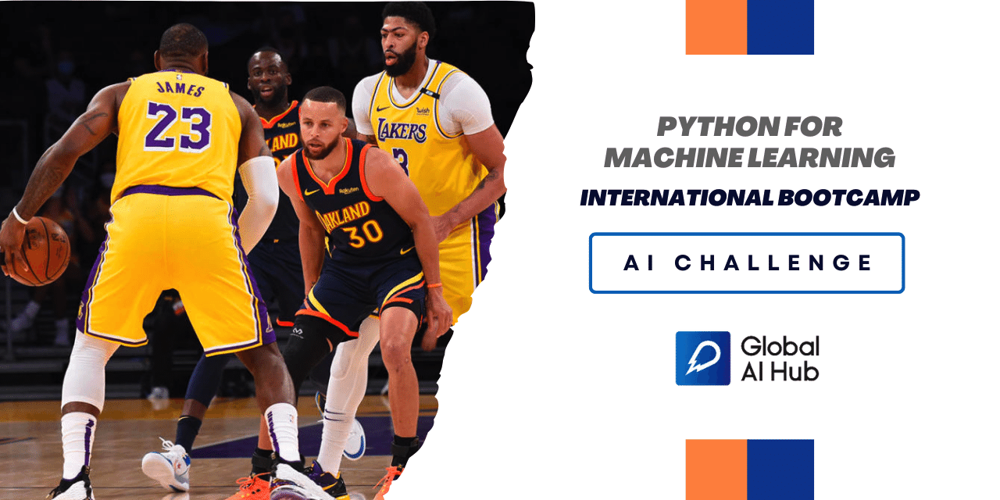

# Predict Career Longevity for NBA Rookies
This is where you get to apply your skills to solve an exciting real-world problem statement.

## Content and Problem Statement
The National Basketball Association (NBA) is a professional basketball league in North America. The league comprises 30 teams (29 in the United States and 1 in Canada) and is one of the four major professional sports leagues in the United States and Canada. It is the premier men's professional basketball league in the world. [source of information: Wikipedia]

Career longevity is dependent on various factors for any player in all the games and so for NBA Rookies. The factors like games played, count of games played, and other statistics of the player during the game.

## Objective
 

Using machine learning techniques determine if a player’s career will flourish or not.

 
